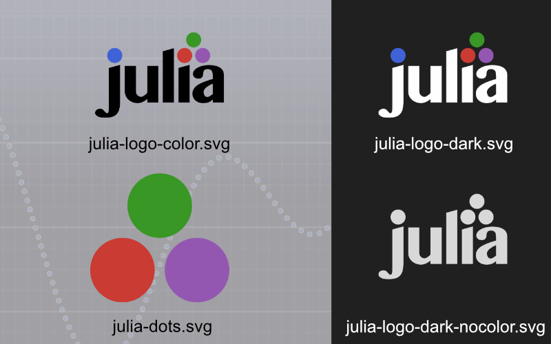
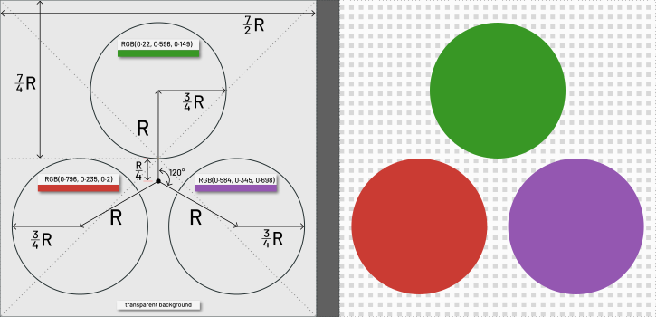
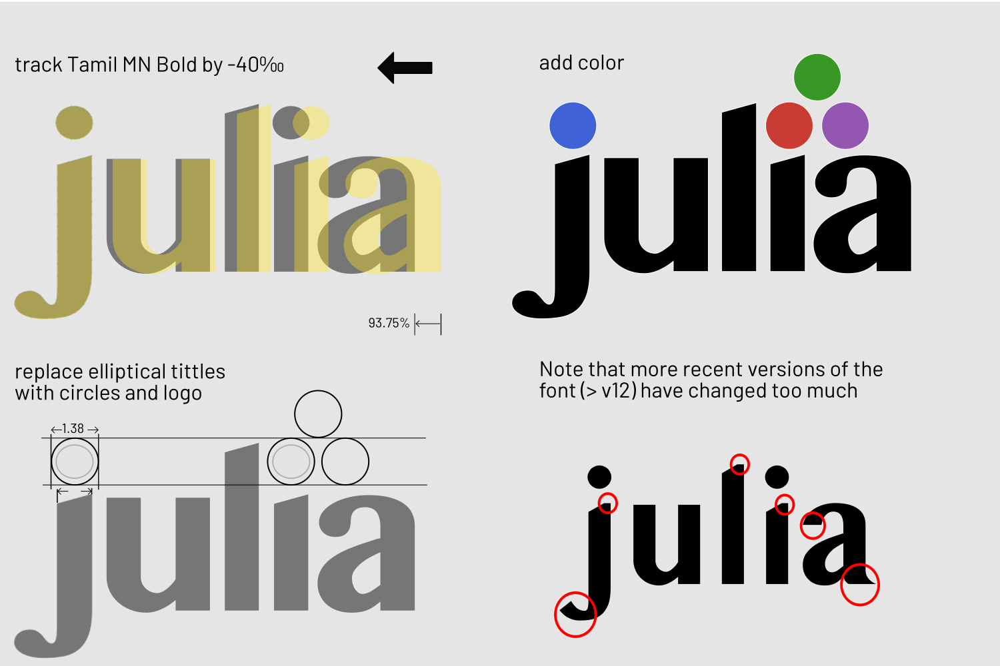
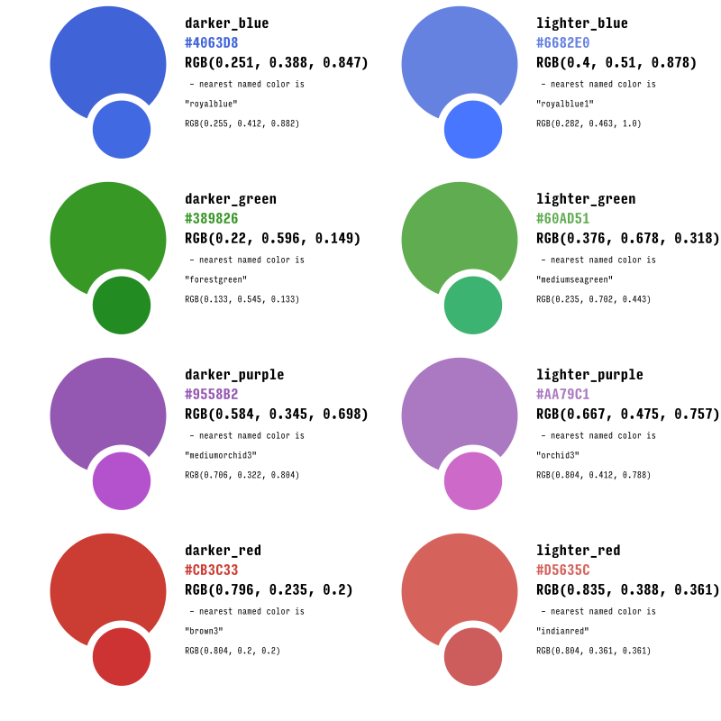
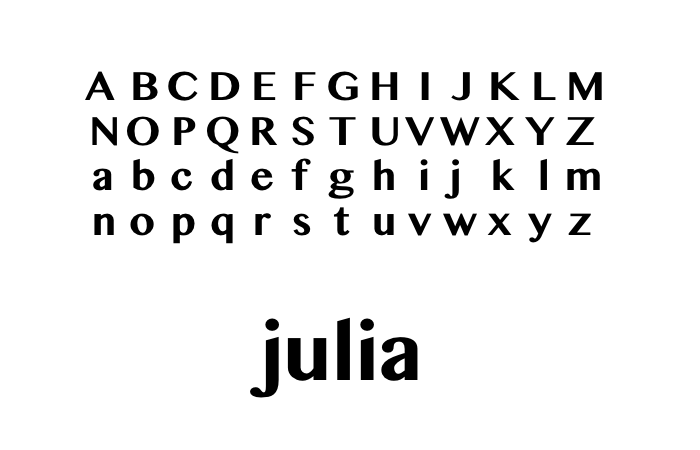
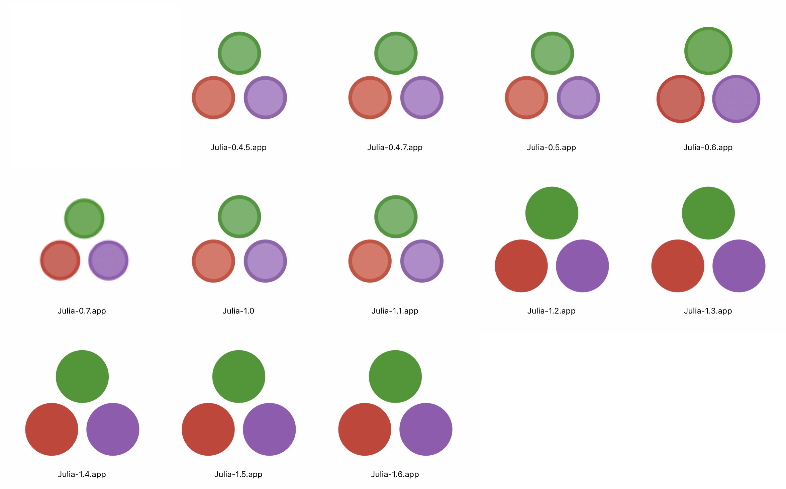

## Julia logo graphics


This repository contains information about the logos used by the Julia programming language.

>[!IMPORTANT]
>Logo designs in this repository are 
>
>Copyright (c) 2012-2022: Stefan Karpinski <stefan@karpinski.org>. 
>
>These designs are licensed under the Creative Commons "BY-NC-SA" 4.0 License. This means that you are free to:
>- Share — copy and redistribute the material in any medium or format
>- Adapt — remix, transform, and build upon the material
>
>If you wish to use the Julia logo as is or derive another logo from it for commercial purposes, you must contact the licensor, Stefan Karpinski, for permission to do so as such usage is not covered under this license.
>
>See LICENSE.md for full details.



### Construction: the julia-circles (aka "julia dots") logo



### Generation: the julia-circles

To generate the julia-circles logo, you can use the following code for Luxor.jl:

```julia
using Luxor
R = 100
Drawing(7R/2, 7R/2, "/tmp/julialogo.svg")
origin()
translate(0, R/4)
juliacircles(R)
finish()
preview()
```

### Construction: the julia-language logo



### Generation: the julia-language logo

To generate the julia-language logo, you can use the following code for Luxor.jl:

```julia
using Luxor
Drawing(360, 260, "/tmp/julia-language-logo.svg")
origin()
julialogo(centered=true)
finish()
preview()
```

Sometimes it’s useful to have a white border (eg for Dark Mode)

```julia
using Luxor
Drawing(360, 260, "/tmp/julia-language-logo-white-border.svg")
origin()
julialogo(centered=true, action=:path)
setline(1)
sethue("white")
strokepath()
julialogo(centered=true)
finish()
preview()
```

### Color definitions

This diagram shows the color values in hexadecimal and RGB, and the nearest you can get if you use only named colors from [Colors.jl](https://github.com/JuliaGraphics/Colors.jl).



### About the font



The font used for the logo’s original design is generally known as TamilMN-Bold, or MN Latin.(MN is Muthu Nedumaran, of [Murasu Systems](http://murasu.com).) Muthu Nedumaran developed several Indic fonts which are currently bundled with Mac OS X: Bangla MN, Gurmukhi MN, Kannada MN, Khmer MN, Lao MN, Malayalam MN, Myanmar MN, Oriya MN, Sinhala MN, Tamil MN, and Telugu MN.

The Latin (ie Western/Roman) character designs for all these fonts use the same distinctive “serifless Times Roman” style.

### LaTeX

See [julia_logo_latex](https://github.com/vancleve/julia_logo_latex) for the LaTEX code to draw the logo.

LaTeX color definitions:

```latex
\usepackage{xcolor}
\definecolor{jlred}{HTML}{CB3C33}
\definecolor{jlblu}{HTML}{4063D8}
\definecolor{jlgrn}{HTML}{389826}
\definecolor{jlprp}{HTML}{9558B2}
```

### Historical notes

Before Julia release v1.2 (August 2019), the Julia circles were duotone, with paler colors inside a darker outline.



### Miscellaneous stock images

There are some general Public Domain CC0-licensed images relating to Julia on [Flickr](https://www.flickr.com/search/?text=julialanguage), tagged with "julialang" or "julialanguage". These should help publishers looking for those vague blurry stock images to illustrate technical topics showing Julia code.


### More Julia code to draw the logos

For more information about drawing Julia logos with Julia code, see [Luxor.jl](https://github.com/JuliaGraphics/Luxor.jl).


An animated logo is at `images/animated-logo.gif`.

### Finder application icons (macOS only)

To display icons for macOS applications, Apple's Finder uses an `.icns` file that can be stored inside an application's bundle, in `/Applications/appname.app/Contents/Resources/`. This file contains the same image at different sizes and resolutions, to handle the scaling/resizing that happens in the Finder. Ideally you would design each size of image separately, tweaking the pixels in each one for the best results, but who has time for that? So the following Julia command-line utility generates this file automatically from a single image (ideally a large PNG). It first creates the necessary images from your provided source image (PNG) file using Apple's `sips` utility, and then runs Apple's `iconutil` utility to build the required `.icns` file.

```julia
#!/usr/bin/env julia

function main(args)
    length(args) != 1 && return @error("supply pathname of an image")
    sourceimage = first(args)
    !isfile(sourceimage) && return @error("Need a valid image as source material")
    fname, ext = splitext(sourceimage)
    ext != ".png" && return @error("Image should have .PNG suffix")
    destinationdirectory = dirname(sourceimage)
    iconsetdirectory = joinpath(destinationdirectory, "$(fname).iconset")
    !isdir(iconsetdirectory) && mkdir(iconsetdirectory)
    newiconname((w, s), ext) = s != 1 ? "icon_$(w)x$(w)$(ext)" : "icon_$(w÷2)x$(w÷2)@2x$(ext)"
    iconspecifications = ((32, 1), (32, 2), (64, 1), (64, 2), (256, 1), (256, 2),
    (512, 1), (512, 2), (1024, 1), (1024, 2))

    # generate all icons for each pair of size/scale parameters
    for pair in iconspecifications
        outputname = newiconname(pair, ext)
        run(`sips
          --resampleHeightWidth $(first(pair)) $(first(pair)) $(sourceimage)
          --out $(joinpath(iconsetdirectory, outputname))`)
    end
    @info "icons stored in $iconsetdirectory"
    # run Apple utility iconutil to convert the icon set to an icns file
    run(`iconutil -c icns $iconsetdirectory -o $(joinpath(destinationdirectory, fname)).icns`)
end

main(ARGS)
```

Save this as, say, `generate-mac-iconset.jl`, then the usage is:

```
generate-mac-iconset.jl path/to/imagefile.png
```
