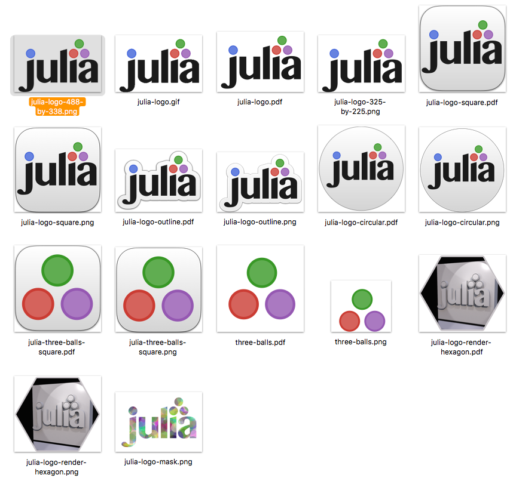
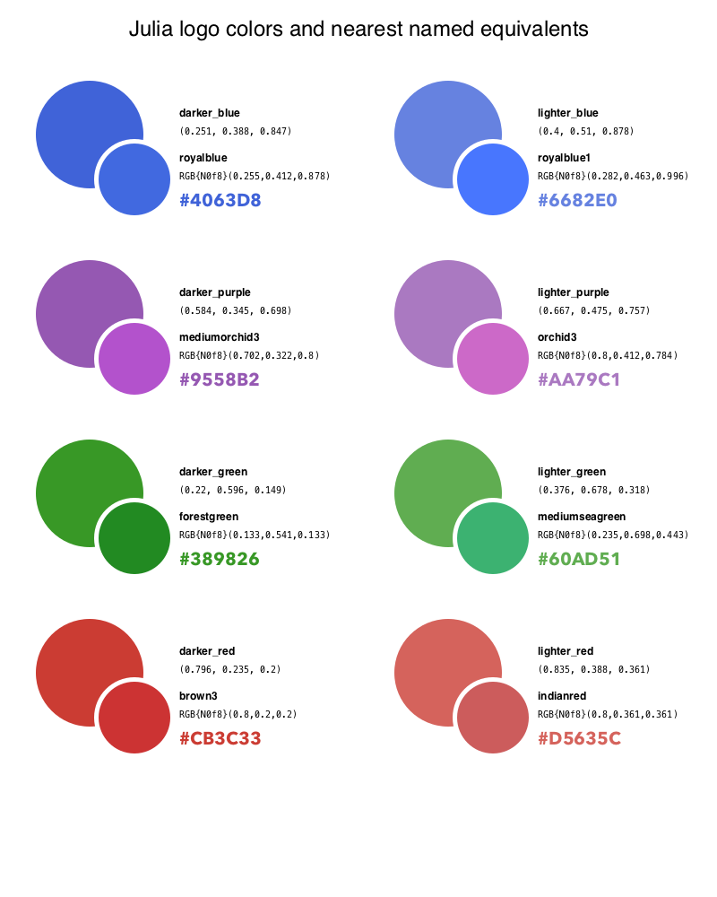

## Julia logo graphics


This project (it's not a Julia package, just a Git repository) contains copies of the logos for the Julia programming language. They are "tidied up" versions of the original logo by Stefan Karpinski, with whom remains all the copyrights and trademarks.



"Tidied up" here means:

- font glyphs converted to outlines
- stray and unwanted points removed
- translucent graphics removed and replaced with solid color
- transparent background (for PNG files)
- thick strokes converted to filled objects with no stroke width

For Julia code to draw logos, see [Luxor](https://github.com/cormullion/Luxor/).


An animated logo is at `images/animated-logo.gif`.

### Color definitions



### About the font


The font used for the logo's original design is generally known as MN Latin. MN is Muthu Nedumaran, of [Murasu Systems](http://murasu.com). Muthu Nedumaran developed several Indic fonts which are currently bundled with Mac OS X: Bangla MN, Gurmukhi MN, Kannada MN, Khmer MN, Lao MN, Malayalam MN, Myanmar MN, Oriya MN, Sinhala MN, Tamil MN, and Telugu MN.

The Latin (ie Western/Roman) character designs for all these fonts use the same distinctive "serifless Times Roman" style.

### Julia-tan

“Julia-tan” is the #JuliaLang (unofficial) anime character, licensed under a Creative Commons Attribution-NonCommercial-ShareAlike 4.0 International License.

Contact Takeshi KIMURA (twitter: @kimrin) for any details of commercial usage.

### Miscellaneous stock images

There are some general Public Domain CC0-licensed images relating to Julia on [Flickr](https://www.flickr.com/search/?text=julialanguage), tagged with "julialang" or "julialanguage". These should help publishers looking for those vague blurry stock images to illustrate technical topics showing Julia code.


### Finder application icons (macOS only)

To display icons for macOS applications, Apple's Finder uses an `.icns` file that can be stored inside an application's bundle, in `/Applications/appname.app/Contents/Resources/`. This file contains the same image at different sizes and resolutions, to handle the scaling/resizing that happens in the Finder. Ideally you would design each size of image separately, tweaking the pixels in each one for the best results, but who has time for that? So the following Julia command-line utility generates this file automatically from a single image (ideally a large PNG). It first creates the necessary images from your provided source image (PNG) file using Apple's `sips` utility, and then runs Apple's `iconutil` utility to build the required `.icns` file.

```julia
#!/usr/bin/env julia

function main(args)
    length(args) != 1 && return @error("supply pathname of an image")
    sourceimage = first(args)
    !isfile(sourceimage) && return @error("Need a valid image as source material")
    fname, ext = splitext(sourceimage)
    ext != ".png" && return @error("Image should have .PNG suffix")
    destinationdirectory = dirname(sourceimage)
    iconsetdirectory = joinpath(destinationdirectory, "$(fname).iconset")
    !isdir(iconsetdirectory) && mkdir(iconsetdirectory)
    newiconname((w, s), ext) = s != 1 ? "icon_$(w)x$(w)$(ext)" : "icon_$(w÷2)x$(w÷2)@2x$(ext)"
    iconspecifications = ((32, 1), (32, 2), (64, 1), (64, 2), (256, 1), (256, 2),
    (512, 1), (512, 2), (1024, 1), (1024, 2))

    # generate all icons for each pair of size/scale parameters
    for pair in iconspecifications
        outputname = newiconname(pair, ext)
        run(`sips
          --resampleHeightWidth $(first(pair)) $(first(pair)) $(sourceimage)
          --out $(joinpath(iconsetdirectory, outputname))`)
    end
    @info "icons stored in $iconsetdirectory"
    # run Apple utility iconutil to convert the icon set to an icns file
    run(`iconutil -c icns $iconsetdirectory -o $(joinpath(destinationdirectory, fname)).icns`)
end

main(ARGS)
```

Save this as, say, `generate-mac-iconset.jl`, then the usage is:

```
generate-mac-iconset.jl path/to/imagefile.png
```
